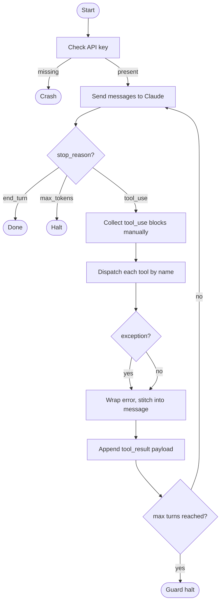
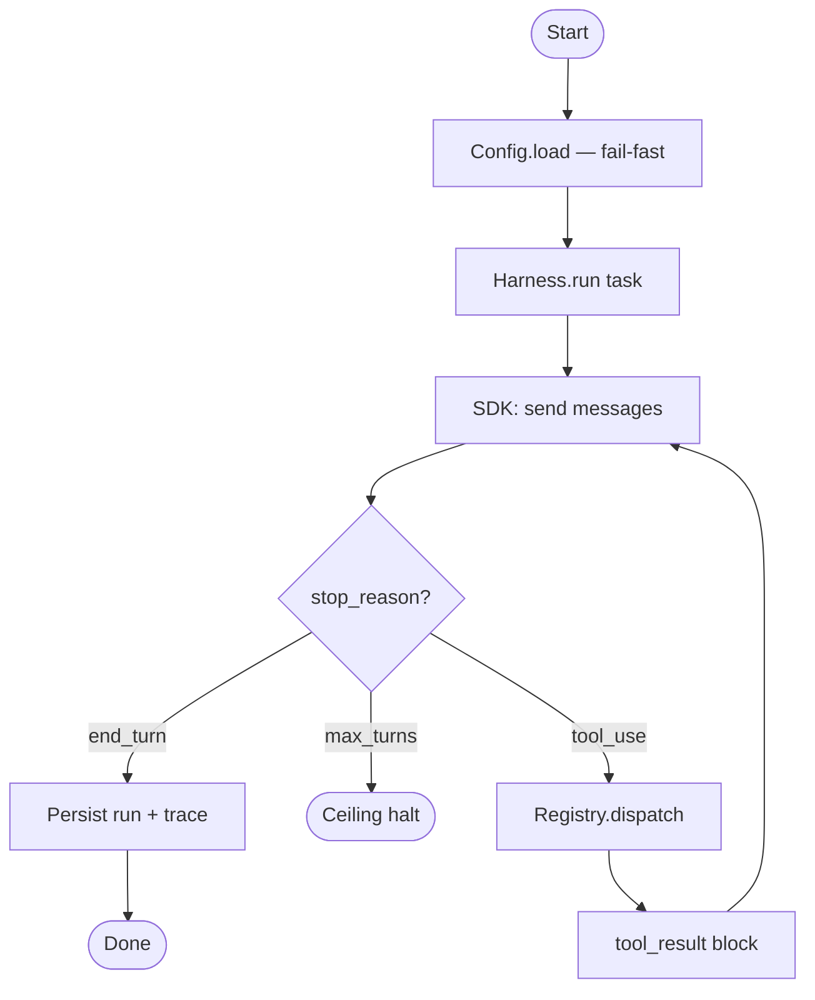
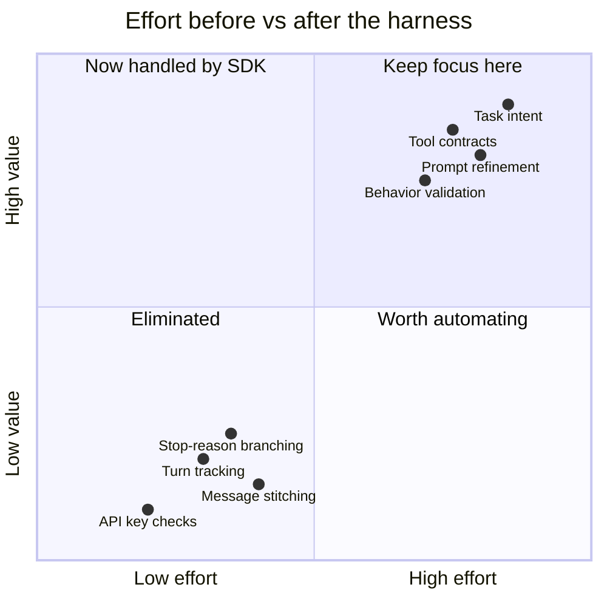

What the harness gave me for free that I wrote myself in agent-from-scratch was the boring but critical plumbing around the model loop. In the scratch project, I manually tracked turns, appended assistant messages, collected tool_use blocks, dispatched each tool, wrapped exceptions, and stitched tool_result payloads back into the next request. I also hand-coded startup checks for missing API keys, stop_reason branching, and guardrails to halt after max turns. The harness removed most of that ceremony. I can focus on task intent, tool contracts, and output quality while the SDK handles lifecycle details, message shaping, and safer defaults. It also made extension easier: adding a helper for related links and a reusable research-summary format feels incremental instead of invasive. Observability improved too, because hooks and conventions give me predictable traces and formatting without custom shell glue everywhere. The practical gain is not magic intelligence; it is leverage. I spend less time rebuilding infrastructure and more time validating behavior, refining prompts, and shipping learning artifacts that are easier to compare, review, and teach. That tradeoff is exactly why this repo exists. It also standardizes defaults, shortens onboarding for collaborators, and reduces regressions because conventions, hooks, and structure stay consistent across sessions.

---

## agent-from-scratch: manual loop

## agent-on-claude-sdk: harness loop

## what moved where

