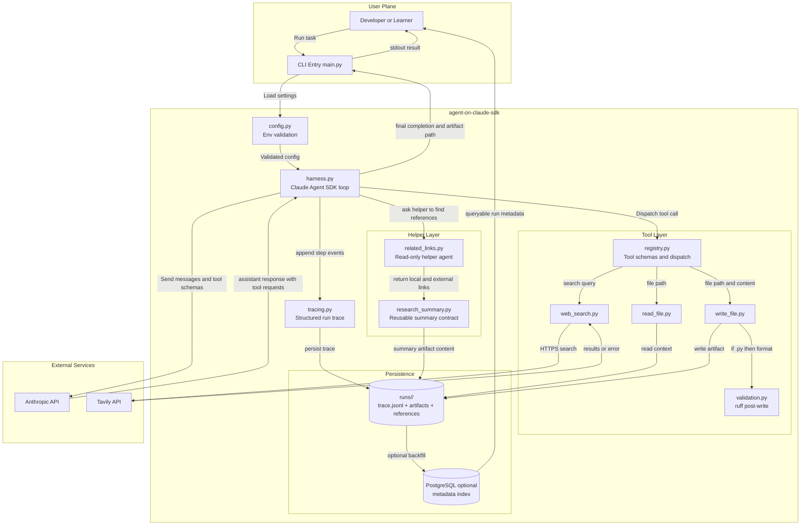

## 1. Stack Summary

| Area | Choice | Why this fits the stories and existing functionality |
|---|---|---|
| Backend language | Python 3.12 | Matches current learning repo conventions and keeps parity with `agent-from-scratch`. |
| Agent runtime | Claude Agent SDK harness on top of Anthropic API | Delivers the same search/read/write loop as the scratch version with less handwritten orchestration. |
| Frontend | None | User stories center on CLI behavior, trace visibility, and generated artifacts, not a web UI. |
| Primary persistence | Filesystem artifacts and run traces | Current behavior already writes durable artifacts (`out.md`) and requires clear, inspectable outputs. |
| Optional metadata DB | PostgreSQL (future phase) | Adds queryability for runs/references when scale grows, while keeping phase-1 minimal. |
| Search integration | Tavily API | Preserves the existing web retrieval behavior from `agent-from-scratch`. |
| Config and secrets | `.env` + `.env.example` + runtime validation | Supports clear startup failures for missing keys and safe public sharing. |
| Formatting | `ruff format` post-write on `.py` outputs | Directly satisfies the automatic formatting story for Python writes. |
| Packaging/env | `uv` + virtual environment | Consistent with project constraints and reproducible Python setup. |
| Testing and CI | `pytest` + GitHub Actions | Supports unit, integration, and behavior validation gates. |
| Deployment | Local Docker Compose (default) | Matches default deployment constraint and supports reproducible local runs. |

## 2. File & Folder Structure

```text
agent-on-claude-sdk/
├── README.md                          # Public entry point, comparison framing, run instructions
├── CLAUDE.md                          # Conventions, safety rules, validation policy
├── user-stories.md                    # Source of truth for scope and acceptance criteria
├── architecture.md                    # This architecture document
├── WRITEUP.md                         # Exactly 200-word harness-vs-scratch reflection
├── pyproject.toml                     # Python 3.12 package metadata, deps, tool config
├── uv.lock                            # Locked dependency graph for reproducibility
├── .env.example                       # Placeholder-only settings template
├── .gitignore                         # Excludes secrets, caches, traces, local clutter
├── .claude/
│   └── settings.json                  # PostToolUse hook: run `ruff format` after written Python files
├── docker-compose.yml                 # Local orchestration of agent service and optional metadata DB
├── Dockerfile                         # Lean runtime image for harness execution
├── scripts/
│   ├── run.sh                         # Standardized run entrypoint for local/dev containers
│   ├── verify_behavior.sh             # Behavior check: search+read+write+clear stop marker
│   └── check_secrets.sh               # Guardrail against committing credential patterns
├── src/
│   └── agent_on_claude_sdk/
│       ├── __init__.py                # Package exports/version
│       ├── main.py                    # CLI entrypoint, task parsing, top-level error handling
│       ├── config.py                  # Env loading and validation (fail-fast required settings)
│       ├── harness.py                 # Claude Agent SDK orchestration loop and message flow
│       ├── tracing.py                 # Step logs, structured events, truncation controls
│       ├── models.py                  # Shared typed contracts for tool/result/run records
│       ├── validation.py              # Post-write formatting hooks (ruff for Python files)
│       ├── tools/
│       │   ├── __init__.py            # Tool registry export
│       │   ├── registry.py            # Tool schema list + dispatcher
│       │   ├── web_search.py          # Tavily-backed search tool
│       │   ├── read_file.py           # UTF-8 text reader + binary/file-not-found handling
│       │   └── write_file.py          # Safe writer + parent-dir checks + artifact responses
│       ├── helpers/
│       │   ├── __init__.py            # Helper exports
│       │   ├── related_links.py       # Read-only Task sub-agent integration, objective: "find related links"
│       │   └── research_summary.py    # Reusable summary structure (question/findings/gaps/next)
│       └── persistence/
│           ├── __init__.py            # Persistence exports
│           ├── fs_store.py            # Run folders, traces, artifacts, references
│           └── pg_store.py            # Optional PostgreSQL metadata adapter (future phase)
├── skills/
│   └── research-summary/
│       └── SKILL.md                   # Reusable summary Skill required by stories
├── tests/
│   ├── unit/
│   │   ├── test_config.py             # Env and validation behaviors
│   │   ├── test_tool_registry.py      # Dispatch/schema contracts
│   │   ├── test_read_file.py          # Read error and text handling
│   │   ├── test_write_file.py         # Write success and parent-dir error handling
│   │   ├── test_web_search.py         # Tavily result/error behavior via mocks
│   │   └── test_validation.py         # Ruff hook behavior and fallback behavior
│   ├── integration/
│   │   └── test_harness_loop.py       # Multi-turn tool flow and stop handling with mocked API
│   └── e2e/
│       └── test_real_run.py           # Real run path verification (search/read/write/stop)
└── runs/
    └── <run-id>/                      # Runtime outputs (trace.jsonl, artifacts/, references.jsonl)
```

## 3. State Management

State is intentionally explicit and traceable.

| State category | Where it lives | Owner (writes) | Readers | Flow |
|---|---|---|---|---|
| Secrets (`ANTHROPIC_API_KEY`, `TAVILY_API_KEY`) | Environment / `.env` | Operator | `config.py` | Loaded at startup, validated once, never logged |
| Runtime settings (`MODEL`, `MAX_TURNS`, `MAX_RESULT_CHARS`) | Environment with defaults | `config.py` | `harness.py`, `tracing.py` | Immutable for a run |
| Conversation message history | In-memory list inside `harness.py` | `harness.py` | Anthropic SDK call + loop internals | `user` task -> assistant tool requests -> user tool results -> assistant final |
| Tool definitions and dispatch map | Static registry in `tools/registry.py` | Tool layer | `harness.py` | Provided to model at each turn, dispatch used on tool calls |
| Tool results (`is_error` included) | In-memory per turn, plus trace output | Tool implementations | `harness.py`, tracer | Collected for all calls in a turn and returned in one message |
| Artifacts (for example `out.md`) | Filesystem under `runs/<run-id>/artifacts/` | `write_file` tool | User, tests, verification scripts | Durable output of runs |
| Run trace events | `runs/<run-id>/trace.jsonl` | `tracing.py` | Maintainers, tests | Step-by-step decision/action/result audit trail |
| Related links result set | `references.jsonl` and optional summary artifact | `helpers/related_links.py` (read-only discovery) | Docs/reporting | Maintains local + external references required by stories |
| Optional metadata index | PostgreSQL (`pg_store.py`) | Persistence adapter | Reporting/analytics scripts | Derived from run records; not source of truth in phase 1 |

Write ownership rule: only the module that owns a state category can mutate it.

## 4. Service Connections

Primary runtime flow:

1. `main.py` loads validated config.
2. `harness.py` sends task + tool schema to Anthropic via Claude Agent SDK.
3. On tool requests, `harness.py` dispatches to `web_search`, `read_file`, `write_file`.
4. Tool outputs return as structured tool results (`is_error` true on failures).
5. Harness posts tool results back to model and continues until completion signal.
6. The related-link workflow spawns one read-only Task sub-agent with objective `find related links`.
7. Trace and artifacts are written to `runs/<run-id>/...`.

Communication matrix:

| From | To | Protocol | Purpose |
|---|---|---|---|
| `harness.py` | Anthropic API | HTTPS | Model turns, tool request generation, final answer |
| `tools/web_search.py` | Tavily API | HTTPS | Up-to-date web retrieval |
| `tools/read_file.py` | Local filesystem | POSIX file I/O | Bring local context into reasoning |
| `tools/write_file.py` | Local filesystem | POSIX file I/O | Persist requested outputs |
| `.claude/settings.json` | Agent hook runtime | PostToolUse hook | Run `ruff format` after written Python files |
| `helpers/related_links.py` | Task sub-agent + local project + web (read-only) | File I/O + HTTPS | Discover references without editing files |
| `persistence/pg_store.py` (optional) | PostgreSQL | TCP/SQL | Queryable run/reference metadata |

Auth flow:

- Anthropic: bearer key from `ANTHROPIC_API_KEY`.
- Tavily: API key from `TAVILY_API_KEY`.
- Optional PostgreSQL: DSN from env (`DATABASE_URL`), least-privilege role.
- No credentials are written to artifacts, traces, or logs.

## 5. Docker & Deployment

Default deployment is local Docker Compose.

`docker-compose.yml` outline:

- `agent` service
- `postgres` service (optional profile, off by default)
- shared bridge network `agent_net`
- bind mount `./runs:/app/runs` for output persistence
- `.env` injected at runtime only

Example shape:

```yaml
services:
  agent:
    build: .
    image: agent-on-claude-sdk:local
    command: ["uv", "run", "python", "-m", "agent_on_claude_sdk.main"]
    env_file:
      - .env
    volumes:
      - ./runs:/app/runs
    networks:
      - agent_net

  postgres:
    image: postgres:16-alpine
    profiles: ["metadata"]
    environment:
      POSTGRES_DB: agent_meta
      POSTGRES_USER: agent
      POSTGRES_PASSWORD: ${POSTGRES_PASSWORD}
    volumes:
      - pg_data:/var/lib/postgresql/data
    networks:
      - agent_net

networks:
  agent_net:
    driver: bridge

volumes:
  pg_data:
```

Docker image strategy:

- Multi-stage build.
- Minimal base image (`python:3.12-slim`).
- Non-root runtime user.
- Dependencies installed via `uv`.
- No secrets in image layers.

Cloud note:

- If moved to AWS/GCP/Azure later, keep the same container and mount/object-store output path.
- Inject secrets via cloud secret manager, never via source control.

## 6. Database Schema

Phase-1 baseline: filesystem-first, no mandatory DB.

Optional PostgreSQL schema for run analytics and reference querying:

```sql
CREATE TABLE runs (
  run_id UUID PRIMARY KEY,
  task TEXT NOT NULL,
  model TEXT NOT NULL,
  status TEXT NOT NULL,
  started_at TIMESTAMPTZ NOT NULL,
  ended_at TIMESTAMPTZ,
  turns_count INT,
  error_summary TEXT
);

CREATE TABLE artifacts (
  artifact_id UUID PRIMARY KEY,
  run_id UUID NOT NULL REFERENCES runs(run_id) ON DELETE CASCADE,
  name TEXT NOT NULL,
  path TEXT NOT NULL,
  artifact_type TEXT NOT NULL,
  content_hash TEXT,
  size_bytes BIGINT,
  validated BOOLEAN NOT NULL DEFAULT FALSE,
  created_at TIMESTAMPTZ NOT NULL DEFAULT NOW()
);

CREATE TABLE references (
  reference_id UUID PRIMARY KEY,
  run_id UUID NOT NULL REFERENCES runs(run_id) ON DELETE CASCADE,
  ref_type TEXT NOT NULL,
  value TEXT NOT NULL,
  discovered_by TEXT NOT NULL,
  relevance TEXT,
  created_at TIMESTAMPTZ NOT NULL DEFAULT NOW()
);

CREATE TABLE settings_snapshot (
  setting_id UUID PRIMARY KEY,
  run_id UUID NOT NULL REFERENCES runs(run_id) ON DELETE CASCADE,
  key TEXT NOT NULL,
  value TEXT,
  source TEXT NOT NULL,
  is_secret BOOLEAN NOT NULL DEFAULT FALSE
);

CREATE INDEX idx_runs_status_started ON runs(status, started_at DESC);
CREATE INDEX idx_artifacts_run_type ON artifacts(run_id, artifact_type);
CREATE INDEX idx_references_run_type ON references(run_id, ref_type);
CREATE INDEX idx_settings_run_key ON settings_snapshot(run_id, key);
```

Migration tooling:

- Use `alembic` if PostgreSQL metadata mode is activated.
- Keep filesystem records as canonical source; DB is a derived, query-optimized index.

Connection pooling:

- `sqlalchemy` engine with conservative pool defaults (`pool_size=5`, `max_overflow=5`) for local usage.

Seeding plan:

- No synthetic business seed data.
- Provide a script to backfill DB metadata from existing `runs/*/metadata.json` and `trace.jsonl`.

## 7. Testing Strategy

Coverage target:

- Unit: >= 85% for tool/config/validation modules.
- Integration: all stop branches and multi-tool turn handling.
- E2E behavior: at least one real task proving search + read + write + explicit completion marker.

Test layers:

1. Unit (`tests/unit`)
2. Integration (`tests/integration`)
3. End-to-end (`tests/e2e`)

Behavior validation gates (required):

- Run harness with default task.
- Confirm trace shows tool invocation and results.
- Confirm artifact exists and matches requested task intent.
- Confirm clear terminal completion marker.
- Confirm failures explicitly name missing setting/file/command.

CI hooks (GitHub Actions):

1. `uv sync`
2. `ruff check .`
3. `ruff format --check .`
4. `pytest tests/unit tests/integration`
5. Optional scheduled or manual `tests/e2e` job with secrets.

## 8. Architecture Diagram



## 9. Long-Term Considerations

Scalability bottlenecks:

- Large local traces and artifacts over long-term runs.
- Sequential tool latency (model + Tavily + file I/O).
- Repeated context growth in long sessions.

Mitigations:

- Rotate/archive run folders.
- Add bounded context summarization for long tasks.
- Introduce optional parallel-safe tool execution where independent.
- Use PostgreSQL metadata indexing for fast reporting queries.

Observability posture:

- JSON-structured logs for decision/action/result events.
- Per-run trace files for reproducibility and teaching.
- Metrics emitted at run end: duration, turns, tool calls, success/failure.

Security posture:

- Strict no-secrets-in-repo policy.
- Runtime-only env injection.
- Path safety checks for writes.
- Least-privilege DB role if metadata DB enabled.
- Dependency pinning and image scanning in CI.

Known trade-offs:

- Filesystem-first keeps system simple but limits multi-user concurrent analytics.
- No frontend improves focus but reduces non-technical accessibility.
- Optional DB path introduces dual persistence modes; requires clear docs.

Evolution roadmap:

1. Phase 1: complete parity with scratch behavior plus harness ergonomics.
2. Phase 2: strengthen helper-agent workflows and richer verification reports.
3. Phase 3: optional cloud deployment profile and managed metadata store.
4. Phase 4: controlled multi-user support with role-based separation.
